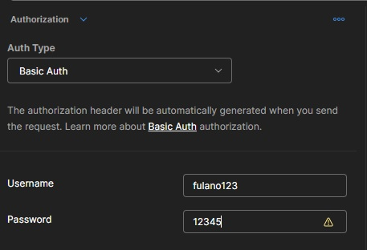
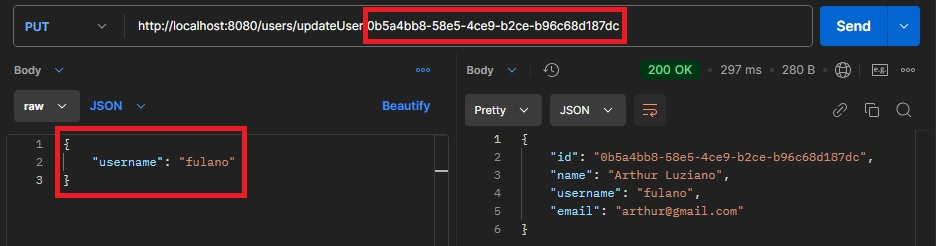

# Endpoints da aplicação.

### Endpoints:

- [**GET**]() (/users/userList)
- [**POST**]() (/users/addUser)
- [**PUT**](#put) (/users/updateUser/{id})
- [**DELETE**]() (/users/remUser/{id})

---

### PUT

Esse endpoint foi desenvolvido com o intuito de atualizar os dados do usuário sempre que necessário.

- Forma correta:

  1.0 - Por padrão, é necessário que o endpoint contenha dados de autorização de um usuário que esteja cadastrado no banco de dados para realizar a alteração dos dados.

  

  1.1 - Após preencher a autorização, confira se o ID do endpoint se trata de um usuário cadastrado no banco de dados e, em seguida, insira os dados que serão atualizados no corpo da requisição. Essa alteração pode ser completa ou parcial.

  

  Curl:

    curl --location --request PUT 'http://localhost:8080/users/updateUser/0b5a4bb8-58e5-4ce9-b2ce-b96c68d187dc' \
    --header 'Content-Type: application/json' \
    --header 'Authorization: Basic aXR6QXJ0OjEyMzQ1' \
    --data '{
        "username": "fulano"
    }'
